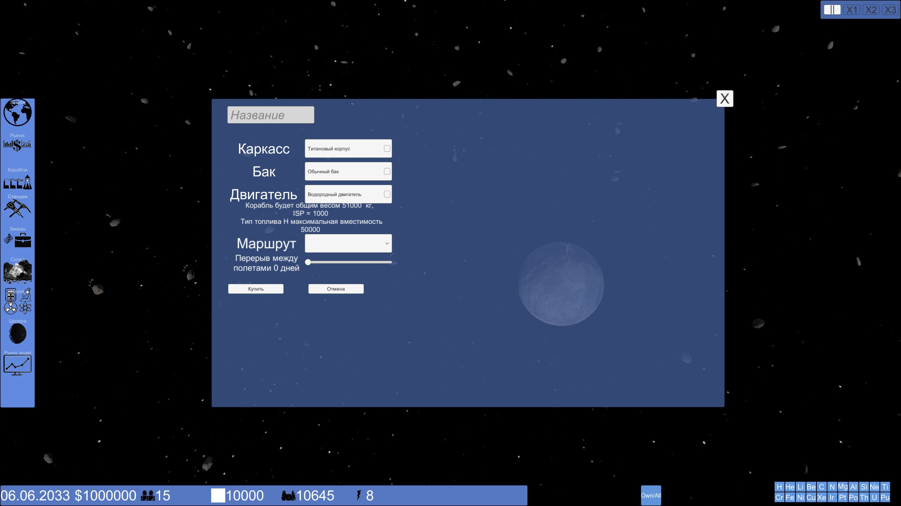
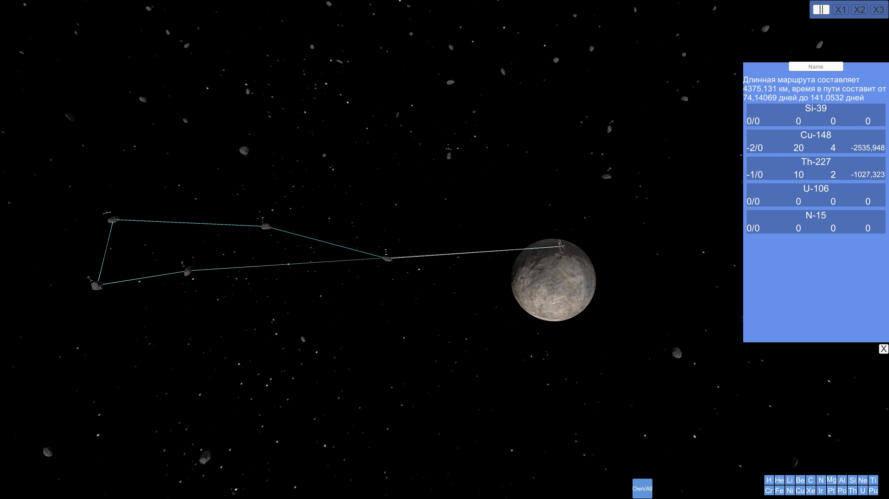
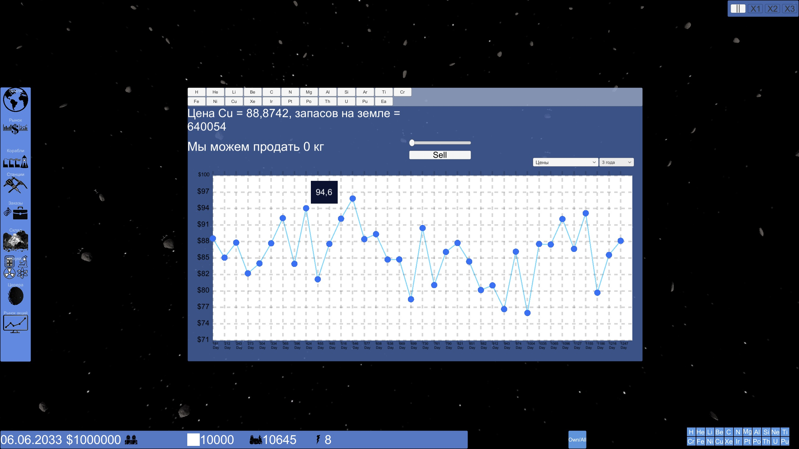
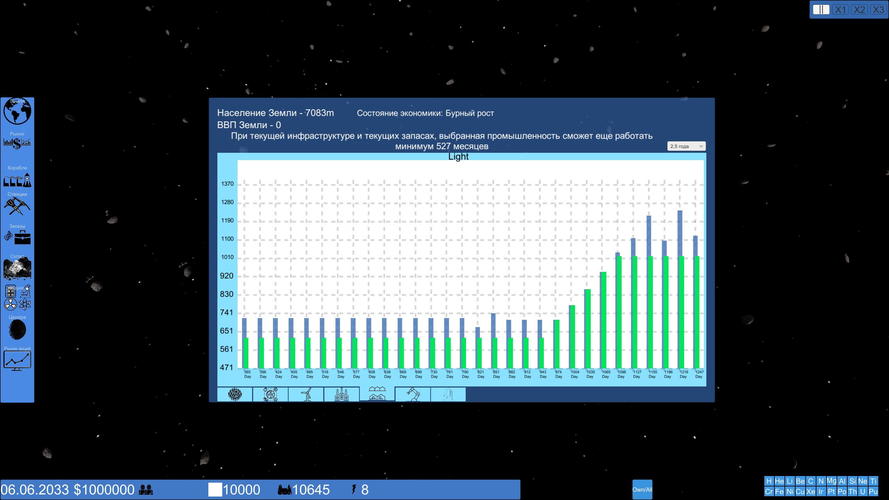
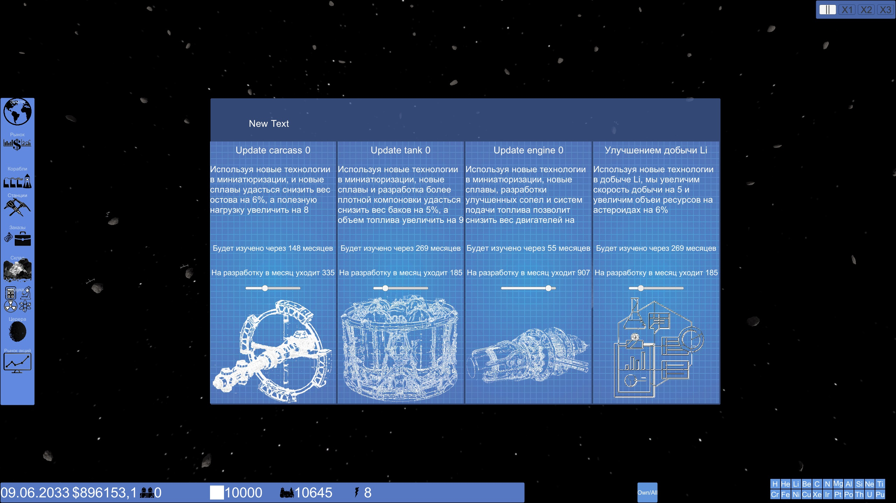
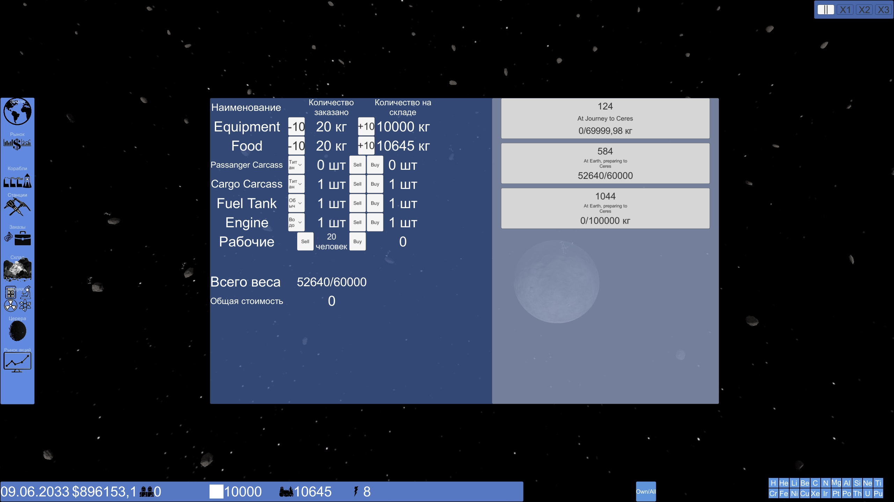
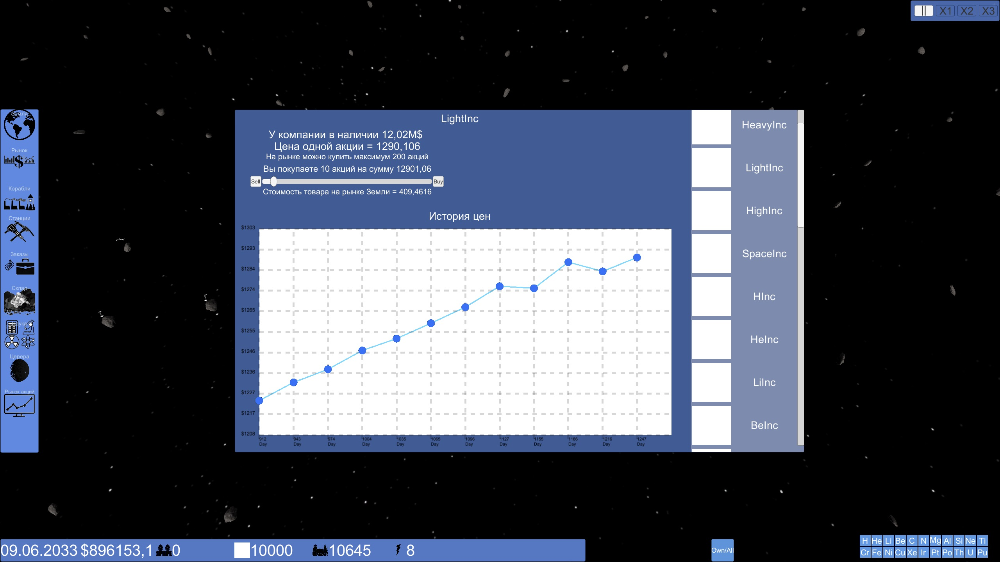
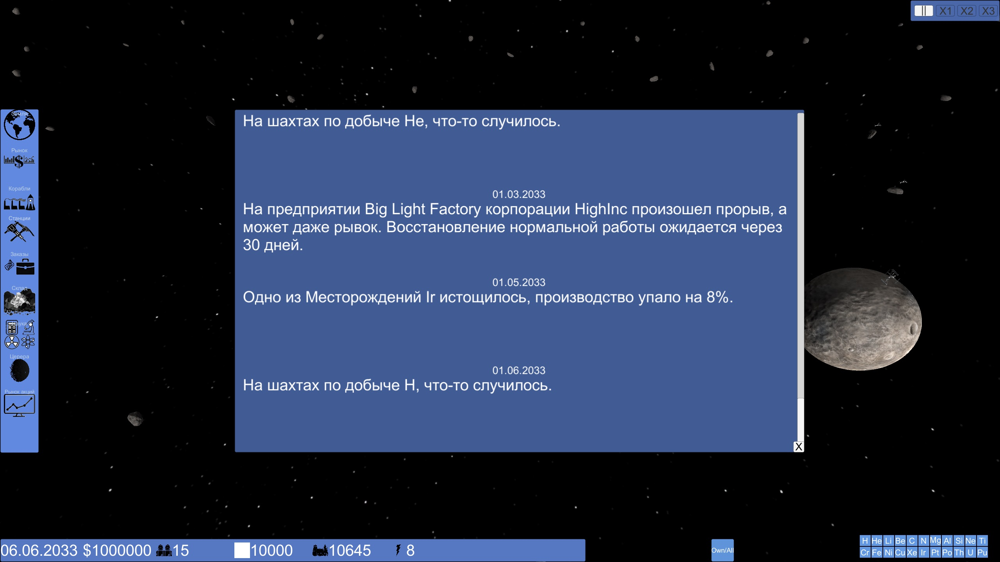

# CeresInc
Моя первая игра на Unity в жанре экономической стратегии. Игра в реальном времени с активной паузой. Главный вид карта в поясе астероидов, геймплей можно условно поделить на следующие категории. Определение какие астероиды ближе всего к Церере (нашей базе), какие ресурсы добывать можно и какие выгоднее всего, строительство маршрута, строительство кораблей. Корабли собираются из каркасса (грузовой или пассажирский), топливного бака и двигателей. Каждый вид имеет свой вес и вносит свои коррективы в дальность и скорость полета, а так же полезную нагрузку. 

Так же кораблю устанавливается маршрут который отдельно создается.

После всех этих действий корабль начинает делать свои задачаи (возить эквипмент и людей если пассажирский, или добытую руду если грузовой) 
На каждый ресурс есть своя цена, она зависит от того сколько ее добывают на Земле и в космосе, сколько потребляют и насколько много ее скопилось. 

Потребление ресурсы зависит от развития промышленность на планете, всего промышленность разделена на энергетическую, тяжелую, легкую, "высокую" (имеется ввиду сложная, такие как автомобильная, авиационная, фармацевтика и т.д.) и космическую. Каждая промышленность потребляет все предыдущие и каждую отдельно дополнительно потребляет население, от роста населения растет потребление, а от нее и производство, чтобы утолить потребность. От уровня космической промышленность зависит сколько кораблей полетит к нам на Цереру забирать руду.

Научный отдел, здесь можно изучать новые технологии, которые разделены на категории: 
- Каркасс. Уменьшает его вес, увеличивает полезную нагрузку
- Топливный бак. Уменьшает вес и увеличивает вместительность.
- Двигатель. Уменьшает вес, увеличивает тягу.
- Улучшение добычи случайного элемента.

Доставка. Корабль с земли прибывает каждые 465 дней, и пока он находится на приколе можно заказть с земли ресурсов, детали для корабля, рабочих, эквипмент.

В игре так же есть другие корпорации в других отделах пояса астероида который мы не видим, они так же добывает строят добывающие базы и добывают ресурсы. Мы можем покупать и продавать их акции, внедрять на базы агентов и устраивать диверсии. 

Так же каждый месяц случаются случайные события, будь то пожар на предприятии на земле и снижение производства, хлопок на складе и потеря ресурсов, смерть членов экипажа и т.д.

